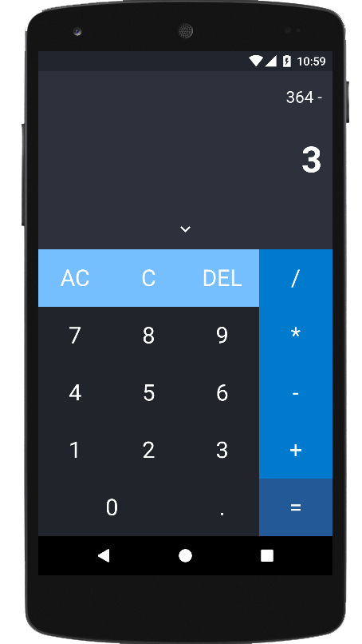
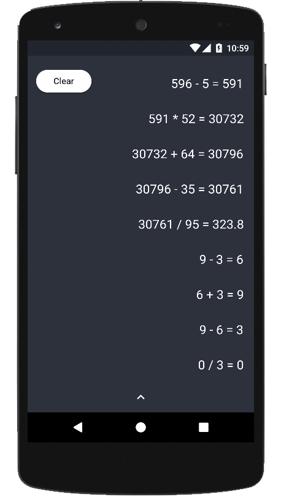
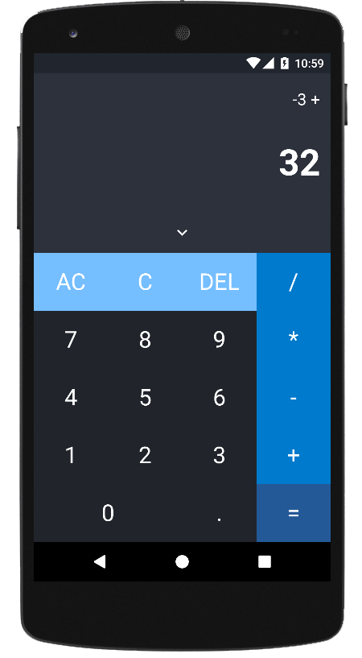

# Flutter Calculator
A full-fledged calculator application built using Flutter and Dart. It allows basic calculations in a contiguous fashion and also has a SQLite database that stores the input data and the results.

## Key Aspects 
1. Facilitates calculations in a continuos fashion
2. Has a SQLite data base that stores the past calculations

## Screenshots

    
    
    

